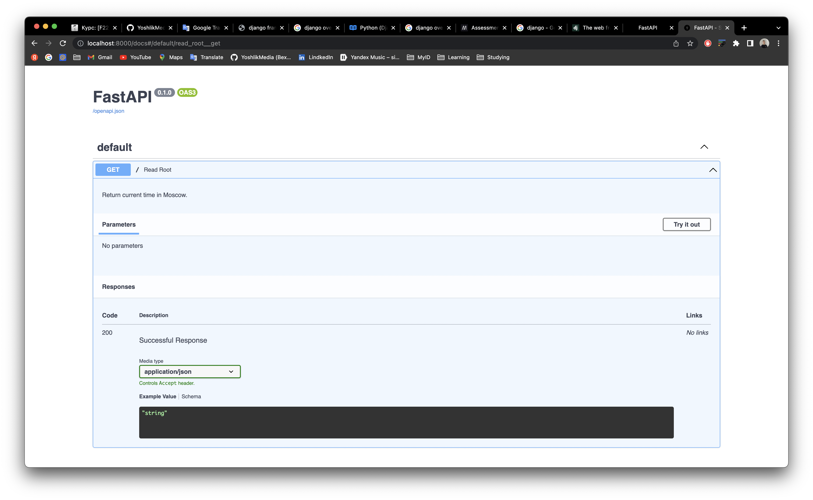

# Django

---


**🚧 [Contact support](https://t.me/bnutfilloyev) if you have any questions/issues.**


### Overview

Django is an extremely popular and fully featured server-side web framework, written in Python. This module shows you why Django is one of the most popular web server frameworks, how to set up a development environment, and how to start using it to create your own web applications.

In a traditional data-driven website, a web application waits for HTTP requests from the web browser (or other client). When a request is received the application works out what is needed based on the URL and possibly information in `POST` data or `GET` data. Depending on what is required it may then read or write information from a database or perform other tasks required to satisfy the request. The application will then return a response to the web browser, often dynamically creating an HTML page for the browser to display by inserting the retrieved data into placeholders in an HTML template.

Django web applications typically group the code that handles each of these steps into separate files:


- **URLs:** While it is possible to process requests from every single URL via a single function, it is much more maintainable to write a separate view function to handle each resource. A URL mapper is used to redirect HTTP requests to the appropriate view based on the request URL. The URL mapper can also match particular patterns of strings or digits that appear in a URL and pass these to a view function as data.
- **View:** A view is a request handler function, which receives HTTP requests and returns HTTP responses. Views access the data needed to satisfy requests via *models*, and delegate the formatting of the response to *templates*.
- **Models:** Models are Python objects that define the structure of an application's data, and provide mechanisms to manage (add, modify, delete) and query records in the database.
- **Templates:** A template is a text file defining the structure or layout of a file (such as an HTML page), with placeholders used to represent actual content. A *view* can dynamically create an HTML page using an HTML template, populating it with data from a *model*. A template can be used to define the structure of any type of file; it doesn't have to be HTML!

### Installing Django

Once you've created a virtual environment, and called `workon` to enter it, you can use *pip3* to install Django.

```bash
pip3 install django~=4.0
```

### Sources

- [Documentation](https://www.djangoproject.com/)
- [Mozilla Developer](https://developer.mozilla.org/)

# FastAPI

---

FastAPI is a modern, fast (high-performance), web framework for building APIs with Python 3.6+ based on standard Python type hints.

### Features

- Based on open standarts
- Automatic docs
- Just Modern Python
- Starlette features
- Pydantic features
- etc.

### Installing

**Requirements**

- Python 3.6+
- FastAPI stands on the shoulders of giants:
    - [Starlette](https://www.starlette.io/) for the web parts.
    - [Pydantic](https://pydantic-docs.helpmanual.io/) for the data parts.

```bash
pip install fastapi
```

You will also need an ASGI server, for production such as [Uvicorn](https://www.uvicorn.org/) or [Hypercorn](https://github.com/pgjones/hypercorn)

```bash
pip install "uvicorn[standard]"
```

### **Interactive API docs**

Now go to [http://localhost:8000/docs](http://127.0.0.1:8000/docs)



### **Alternative API docs**

And now, go to [http://localhost:8000/redoc](http://127.0.0.1:8000/redoc)


---

---

---

# Linters

---

Linters are programs that advise about code quality by displaying warnings and errors. They can detect your Python code mistakes, notice invalid code patterns and find elements that do not follow your conventions. Python linters have a number of advantages, such as:

### ****The Pylint****

The Pylint is a static Python code analysis tool that finds programming and stylistic errors, bugs, invalid code constructs and inconsistencies with the coding standards. Moreover, Pylint can be customized to our needs by silencing some of the reported bugs, e.g. output messages can contain only information about errors for the most important programming issues.

### ****Flake8****

Another example of a Python linter is Flake8. It returns a report that contains information about incorrect style, syntax inconsistencies and complexity errors. There are many extra options that allow you to fit Flake8 to your needs.

### ****PyFlakes****

PyFlakes analyzes python codes for simple errors. PyFlakes will never complain about style and will try very hard to never throw out false positives.

🤷‍♂️ **Which is the best python linter for your project?**

