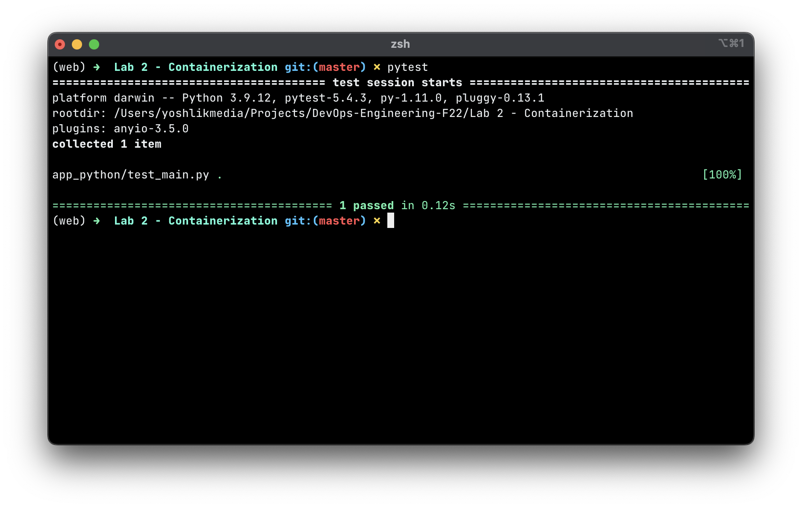

# Containerazation

### Web application

**Create the FastAPI Code**

*Develop and test a simple Python web application, that shows current time in Moscow.*

- Create an `app_python` directory and enter it.
- Create an empty file `__init__.py`.
- Create a `main.py` file with:

```python
from fastapi import FastAPI
from datetime import datetime
from pytz import timezone
import uvicorn

app = FastAPI()

@app.get("/")
def read_root():
    """Return current time in Moscow."""
    moscow = timezone('Europe/Moscow')
    return {"Moscow time": datetime.now(moscow).strftime("%H:%M:%S")}
```

### **Dockerfile**

Now in the same project directory create a file `Dockerfile` with:

```docker
FROM python:3.9

WORKDIR /code

COPY ./requirements.txt /code/requirements.txt
 
RUN pip install --no-cache-dir --upgrade -r /code/requirements.txt
 
COPY ./app /code/app
 
CMD ["uvicorn", "app.main:app", "--host", "0.0.0.0", "--port", "80"]
```

You should now have a directory structure like:

```bash
.
├── app_python
│   ├── __init__.py
│   ├── test_main.py
│   └── main.py
├── Dockerfile
├── DOCKER.md
├── README.md
└── requirements.txt
```
### Testing
Testing with `pytest`
    
```bash
$ pytest
    ======================================== test session starts =========================================
    platform darwin -- Python 3.9.12, pytest-5.4.3, py-1.11.0, pluggy-0.13.1
    rootdir: /Users/yoshlikmedia/Projects/DevOps-Engineering-F22/Lab 2 - Containerization
    plugins: anyio-3.5.0
    collected 1 item
    
    app_python/test_main.py .                                                                      [100%]
    
    ========================================= 1 passed in 0.12s ==========================================
```


### **Build the Docker Image**

Now that all the files are in place, let's build the container image.

- Go to the project directory (in where your `Dockerfile` is, containing your `app_python` directory).
- Build your FastAPI image:

```bash
docker build -t app_python .
```

### **Start the Docker Container**

- Run a container based on your image:

```bash
docker run -d --name app_python -p 80:80 app_python
```

### LOGIN

- Using `docker login` from the CLI, log in using your original Docker ID and pull your private images.

### PUSHING

- When you build them, using `docker build -t <hub-user>/<repo-name>[:<tag>]`
- By re-tagging an existing local image `docker tag <existing-image> <hub-user>/<repo-name>[:<tag>]`
- By using `docker commit <existing-container> <hub-user>/<repo-name>[:<tag>]` to commit changes


```bash
docker login

docker tag a0e144f79bc2 yoshlikmedia/containerization_lesson:latest
docker commit 96216865cdfe yoshlikmedia/containerization_lesson:latest
docker push yoshlikmedia/containerization_lesson:latest

docker run -it --rm -p 81:80 yoshlikmedia/containerization_lesson:latest

docker build -t yoshlikmedia/containerization_lesson:v1.0.0  .
docker run -p 82:80 d3de57ed9472

docker commit f83f69ad67fd yoshlikmedia/containerization_lesson:v1.0.0
docker push yoshlikmedia/containerization_lesson:v1.0.0\n
```