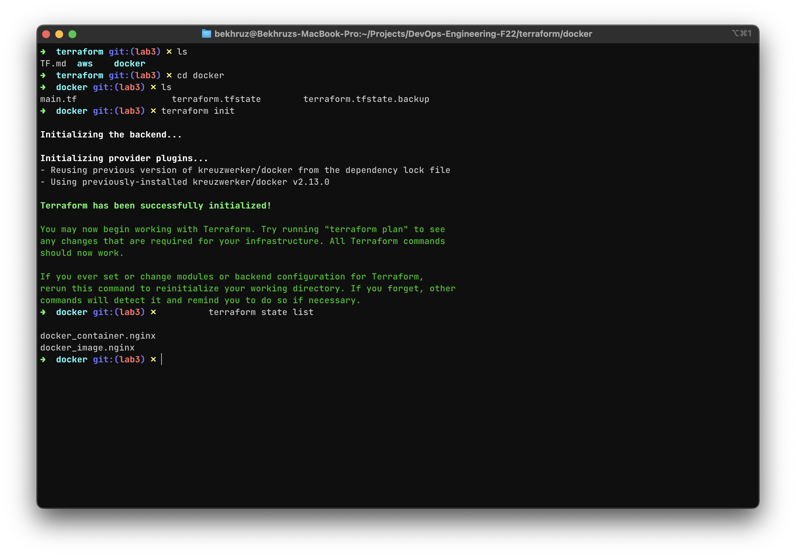
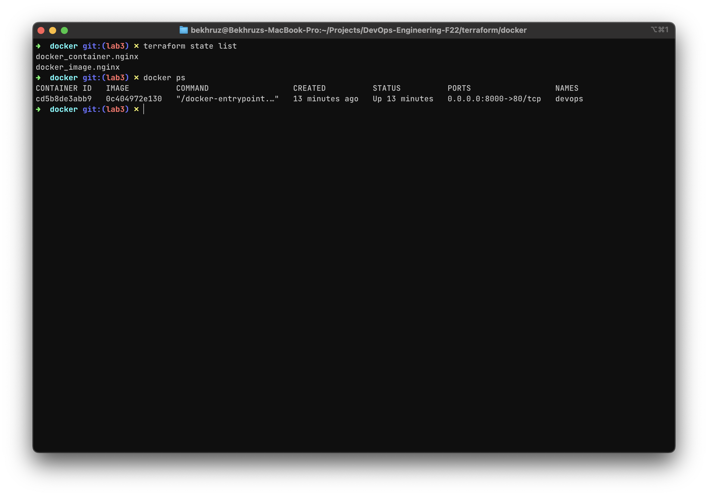

# Terraform

## Docker

After the installation process, the following configs are loaded into the main.tf file.

```terraform
terraform {
  required_providers {
    docker = {
      source  = "kreuzwerker/docker"
      version = "~> 2.13.0"
    }
  }
}

provider "docker" {}

resource "docker_image" "nginx" {
  name         = "nginx:latest"
  keep_locally = false
}

resource "docker_container" "nginx" {
  image = docker_image.nginx.latest
  name  = "first_step"
  ports {
    internal = 80
    external = 8000
  }
}
```

### Build Infrastructure

 ```sh
 $ terraform init
 $ terraform plan
 $ terraform apply
 ```

### Output



### Change Docker container name

```terraform
resource "docker_container" "nginx" {
  image = docker_image.nginx.latest
  name  = "devops_labs"
  ports {
    internal = 80
    external = 8000
  }
}
```



## GITHUB & TERRAFORM

### Build GitHub infrastructure

```terraform
terraform {
  required_providers {
    github = {
      source  = "integrations/github"
      version = "~> 4.0"
    }
  }
}
```

### Setup environment variables

```terraform
# config.auto.tfvars file
token = "YOUR TOKEN"
```

```terraform
# variables.tf file
variable "token" {
  type        = string
  description = "Specifies the GitHub PAT token or `GITHUB_TOKEN`"
  sensitive   = true
}
```

```terraform
# main.tf file
provider "github" {
  token = var.token # or `GITHUB_TOKEN`
}
```

### Create a repository

```terraform
resource "github_repository" "repo" {
  name               = "terraform-github-repo-test"
  description        = "My awesome codebase"
  visibility         = "public"
  has_issues         = true
  has_wiki           = true
  auto_init          = true
  license_template   = "mit"
  gitignore_template = "Python"
}
```

